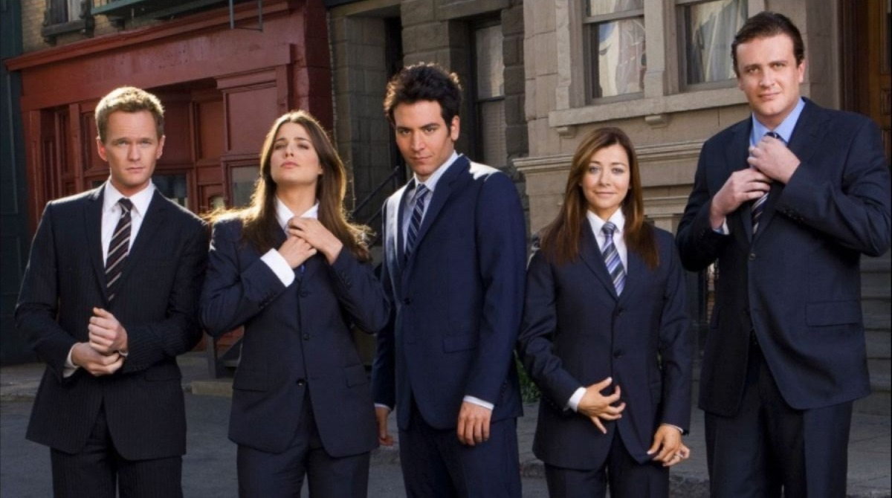

# Ebony Tempral - Light Box Character Build
This is my repo for homework #2: Character build (CSS Selection and Styles)

### About My Process
CSS is extremely fascinating to me. I see it as the first step to bringing a webpage to life. There are many elements that I still struggle to fully grasp but I know with time and practice, it will come a bit more natural to me. Some of the style changes I made to the original code include:
- the body's background colour and text colour
- header colour
- logo width
- character image elements such as padding and box shadow
- hover animation

### Why I choose How I Met Your Mother (HIMYM)
This TV show has been a comfort show of mine since highschool. It's been in my rotation of rewatched shows for years (just like The Office). I've grown a strong connection with the characters and never get bored of the storyline. It's funny, a bit cartoony but relatable and overall very entertaining. I highly reccommend. I'm probably closer to watching HIMYM atleat 15 times at this point and can't to watch it 15 more times :D

## Installation
No installation required
## Usage
Open in browser of your choice
## Contributing
1. Ebony Tempral
2. Create your feature branch: `git checkout -b my-new-feature`
3. Commit your changes: `git commit -am 'Add some feature'`
4. Push to the branch: `git push origin my-new-feature`
5. Submit a pull request
## History
Submit a pull request
## Credits
Ebony Tempral 
## License
See license file
